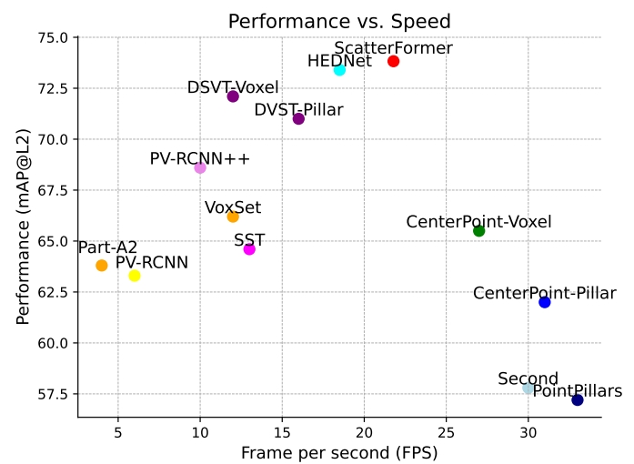

# ScatterFormer: Efficient Voxel Transformer with Scattered Linear Attention
	

This repo is the official implementation of paper: [ScatterFormer: Efficient Voxel Transformer with Scattered Linear Attention](assets/scatterformer.pdf). It achieves 73.8 mAP L2 on Waymo Open Dataset val and 72.4 NDS on NuScenes val. The scatterformer achieve real-time speed of 23 FPS.

<!-- > ScatterFormer: Efficient Voxel Transformer with Scattered Linear Attention
>
> [Chenhang He*](https://skyhehe123.github.io/), Ruihuang Li, Guowen Zhang, Lei Zhang -->


<div align="center">
  
</div>

## News
- [24-06-21] Scatterformer is accepted by ECCV 2024!  
- [24-07-18] Training code released 


## Main results

<!-- ### Waymo Open Dataset validation
|  Model  |  #Sweeps | mAP/H_L1 | mAP/H_L2 | Veh_L1 | Veh_L2 | Ped_L1 | Ped_L2 | Cyc_L1 | Cyc_L2 | Log |
|---------|---------|--------|--------|--------|--------|--------|--------|--------|--------|--------|
|  [ScatterFormer (20%)](tools/cfgs/dsvt_models/dsvt_plain_1f_onestage.yaml) | 1       |  79.5/77.1  | 73.2/71.0  | 79.3/78.8 | 70.9/70.5 | 82.8/77.0 | 75.2/69.8 | 76.4/75.4 | 73.6/72.7 | [Log](https://drive.google.com/file/d/1DlEMIb-ZUFilJBDd8fuyb8nuRnSFPzWy/view?usp=share_link) |
|  [ScatterFormer (100%)](tools/cfgs/dsvt_models/dsvt_plain_1f_onestage.yaml) | 1       |  79.5/77.1  | 73.2/71.0  | 79.3/78.8 | 70.9/70.5 | 82.8/77.0 | 75.2/69.8 | 76.4/75.4 | 73.6/72.7 | [Log](https://drive.google.com/file/d/1DlEMIb-ZUFilJBDd8fuyb8nuRnSFPzWy/view?usp=share_link) |
|  [ScatterFormer (20%)](tools/cfgs/dsvt_models/dsvt_plain_1f_onestage.yaml) | 4       |  79.5/77.1  | 73.2/71.0  | 79.3/78.8 | 70.9/70.5 | 82.8/77.0 | 75.2/69.8 | 76.4/75.4 | 73.6/72.7 | [Log](https://drive.google.com/file/d/1DlEMIb-ZUFilJBDd8fuyb8nuRnSFPzWy/view?usp=share_link) |
|  [ScatterFormer (100%)](tools/cfgs/dsvt_models/dsvt_plain_1f_onestage.yaml) | 4       |  79.5/77.1  | 73.2/71.0  | 79.3/78.8 | 70.9/70.5 | 82.8/77.0 | 75.2/69.8 | 76.4/75.4 | 73.6/72.7 | [Log](https://drive.google.com/file/d/1DlEMIb-ZUFilJBDd8fuyb8nuRnSFPzWy/view?usp=share_link) |


### NuScenes validation
|  Model  | mAP | NDS | mATE | mASE | mAOE | mAVE| mAAE | ckpt | Log |
|---------|---------|--------|---------|---------|--------|---------|--------|--------|--------|
|  [ScatterFormer](tools/cfgs/dsvt_models/dsvt_plain_1f_onestage_nusences.yaml) | 66.4 | 71.1 | 27.0 | 24.8 | 27.2 | 22.6 | 18.9| [ckpt](https://drive.google.com/file/d/10d7c-uJxg5w4GN-JmRBQi4gQDwHiOHxP/view?usp=drive_link)| [Log](https://drive.google.com/file/d/1xAQgcT8Ld0-qL9z1KD_khWXuukpoBBo9/view?usp=drive_link)| -->


## Usage
### Installation
Please refer to [INSTALL.md](docs/INSTALL.md) for installation.

### Dataset Preparation
Please follow the instructions from [OpenPCDet](https://github.com/open-mmlab/OpenPCDet/blob/master/docs/GETTING_STARTED.md). We adopt the same data generation process.

### Sparse Group-wise Convolution
ScatterFormer relies on a group-wise sparse convolution, please find this hacked version of [spconv](https://github.com/skyhehe123/spconv) 

### Training
```
# multi-gpu training
cd tools
bash scripts/dist_train.sh 8 --cfg_file <CONFIG_FILE> [other optional arguments]
```

### Testing
```
# multi-gpu testing
cd tools
bash scripts/dist_test.sh 8 --cfg_file <CONFIG_FILE> --ckpt <CHECKPOINT_FILE>
```

