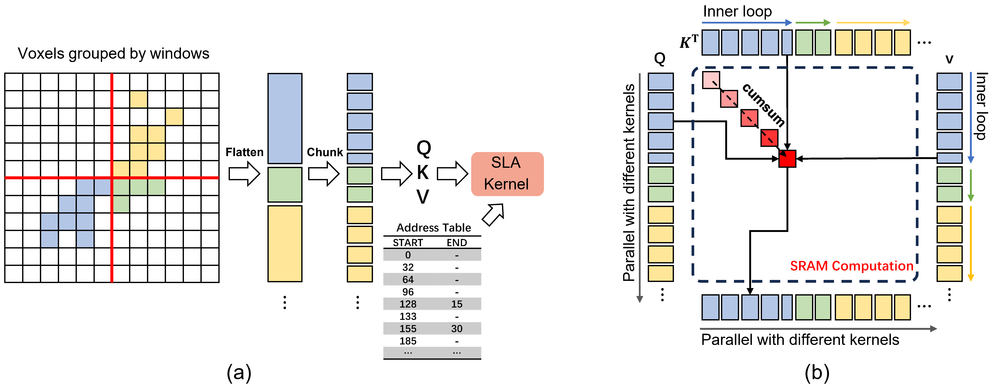

# ScatterFormer: Efficient Voxel Transformer with Scattered Linear Attention
	

This repo is the official implementation of paper: [ScatterFormer: Efficient Voxel Transformer with Scattered Linear Attention](https://arxiv.org/pdf/2401.00912.pdf). It achieves state-of-the-art performance on large-scale Waymo Open Dataset with real-time inference speed.

> ScatterFormer: Efficient Voxel Transformer with Scattered Linear Attention
>
> [Chenhang He*](https://skyhehe123.github.io/), Ruihuang Li, Guowen Zhang, Lei Zhang


<div align="center">
  
</div>


## Introduction
Window-based transformers have demonstrated strong ability in large-scale point cloud understanding by capturing context-aware representations with affordable attention computation in a more localized manner. However, because of the sparse nature of point clouds, the number of voxels per window varies significantly. Current methods partition the voxels in each window into multiple subsets of equal size, which cost expensive overhead in sorting and padding the voxels, making them run slower than sparse convolution based methods. In this paper, we present ScatterFormer, which, for the first time to our best knowledge, could directly perform attention on voxel sets with variable length. The key of ScatterFormer lies in the innovative Scatter Linear Attention (SLA) module, which leverages the linear attention mechanism to process in parallel all voxels scattered in different windows. Harnessing the hierarchical computation units of the GPU and matrix blocking algorithm, we reduce the latency of the proposed SLA module to less than 1 ms on moderate GPUs. Besides, we develop a cross-window interaction module to simultaneously enhance the local representation and allow the information flow across windows, eliminating the need for window shifting. Our proposed ScatterFormer demonstrates `73 mAP` (L2) on the large-scale Waymo Open Dataset and `70.5 NDS` on the NuScenes dataset, running at an outstanding detection rate of 28 FPS.


## Main results

### Waymo Open Dataset validation
|  Model  |  #Sweeps | mAP/H_L1 | mAP/H_L2 | Veh_L1 | Veh_L2 | Ped_L1 | Ped_L2 | Cyc_L1 | Cyc_L2 | Log |
|---------|---------|--------|--------|--------|--------|--------|--------|--------|--------|--------|
|  [ScatterFormer (20%)](tools/cfgs/dsvt_models/dsvt_plain_1f_onestage.yaml) | 1       |  79.5/77.1  | 73.2/71.0  | 79.3/78.8 | 70.9/70.5 | 82.8/77.0 | 75.2/69.8 | 76.4/75.4 | 73.6/72.7 | [Log](https://drive.google.com/file/d/1DlEMIb-ZUFilJBDd8fuyb8nuRnSFPzWy/view?usp=share_link) |
|  [ScatterFormer (20%)](tools/cfgs/dsvt_models/dsvt_plain_1f_onestage.yaml) | 4      |  79.5/77.1  | 73.2/71.0  | 79.3/78.8 | 70.9/70.5 | 82.8/77.0 | 75.2/69.8 | 76.4/75.4 | 73.6/72.7 | [Log](https://drive.google.com/file/d/1DlEMIb-ZUFilJBDd8fuyb8nuRnSFPzWy/view?usp=share_link) |
|  [ScatterFormer (100%)](tools/cfgs/dsvt_models/dsvt_plain_1f_onestage.yaml) | 1       |  79.5/77.1  | 73.2/71.0  | 79.3/78.8 | 70.9/70.5 | 82.8/77.0 | 75.2/69.8 | 76.4/75.4 | 73.6/72.7 | [Log](https://drive.google.com/file/d/1DlEMIb-ZUFilJBDd8fuyb8nuRnSFPzWy/view?usp=share_link) |
|  [ScatterFormer (100%)](tools/cfgs/dsvt_models/dsvt_plain_1f_onestage.yaml) | 4      |  79.5/77.1  | 73.2/71.0  | 79.3/78.8 | 70.9/70.5 | 82.8/77.0 | 75.2/69.8 | 76.4/75.4 | 73.6/72.7 | [Log](https://drive.google.com/file/d/1DlEMIb-ZUFilJBDd8fuyb8nuRnSFPzWy/view?usp=share_link) |

### NuScenes validation
|  Model  | mAP | NDS | mATE | mASE | mAOE | mAVE| mAAE | ckpt | Log |
|---------|---------|--------|---------|---------|--------|---------|--------|--------|--------|
|  [ScatterFormer](tools/cfgs/dsvt_models/dsvt_plain_1f_onestage_nusences.yaml) | 66.4 | 71.1 | 27.0 | 24.8 | 27.2 | 22.6 | 18.9| [ckpt](https://drive.google.com/file/d/10d7c-uJxg5w4GN-JmRBQi4gQDwHiOHxP/view?usp=drive_link)| [Log](https://drive.google.com/file/d/1xAQgcT8Ld0-qL9z1KD_khWXuukpoBBo9/view?usp=drive_link)|


## Usage
### Installation
Please refer to [INSTALL.md](docs/INSTALL.md) for installation.

### Dataset Preparation
Please follow the instructions from [OpenPCDet](https://github.com/open-mmlab/OpenPCDet/blob/master/docs/GETTING_STARTED.md). We adopt the same data generation process.

### Training
```
# multi-gpu training
cd tools
bash scripts/dist_train.sh 8 --cfg_file <CONFIG_FILE> [other optional arguments]
```


### Testing
```
# multi-gpu testing
cd tools
bash scripts/dist_test.sh 8 --cfg_file <CONFIG_FILE> --ckpt <CHECKPOINT_FILE>
```


